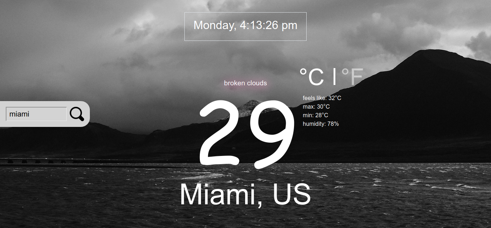

# Weather App
> The main goal of this project was to implement asynchronous communication with promises or async/await in javascript. The project specification can be found [here](https://www.theodinproject.com/courses/javascript/lessons/weather-app).

## Built With

- HTMl,
- CSS,
- Javascript

## Live Demo

[Live Demo Link](https://misterpaul4.github.io/Weather-GT/)

## Getting Started

- Clone the repository to get a local copy `git clone https://github.com/misterpaul4/Weather-GT`
- In the project's directory, install dependencies by running `npm install`
- `npm run build` to compile
- inside the docs folder, open the index.html with your browser.

## Authors

👤 **Chukwuebuka Paul Ajuizeogu**
- Github: [@misterpaul4](https://github.com/misterpaul4)
- Twitter: [@paulajuze](https://twitter.com/paulajuze)
- Linkedin: [Chukwuebuka Paul Ajuizeogu](https://www.linkedin.com/in/chukwuebuka-paul-ajuizeogu/)

## 🤝 Contributing

Contributions, issues and feature requests are welcome!

Feel free to check the [issues page](issues/).

## Show your support

Give a ⭐️ if you like this project!

## 📝 License

This project is [MIT](lic.url) licensed.